Agents4Energy (A4E) is an easily configurable and deployable, set of open-source agentic workflows to help customers in Energy industry accelerate their workloads on AWS. A4E enables industry professionals to use generative AI assistants for a range of common energy industry use cases such as reservoir characterization, well workover assessment, field data analysis, supply chain optimization, and asset integrity management.

To address the needs of the energy industry and harness the great power presented by GenAI, AWS is proud to announce Agents4Energy. This solution makes it easy for operators and service companies to incorporate the sixth generation of computing into their existing technical environments. Much like a travel agent handles the nitty-gritty details of booking a vacation for you, energy agents scan diverse data sources and enterprise systems to unlock insights and complete tasks on your behalf.

## Architecture Overview

The following diagram illustrates the high-level architecture of the GenAI Agentic platform:

```mermaid
graph LR
    %% User and Frontend
    UserBrowser["👤🌐 User Web Browser<br/>Business Stakeholder"]
    
    %% AWS Cloud Container
    subgraph AWS["☁️ AWS Cloud"]
        Amplify["☁️ AWS Amplify<br/>Frontend Hosting<br/>React Application"]
        AppSync["🔄 AWS AppSync<br/>GraphQL API<br/>Real-time Data"]
        
        subgraph LambdaContainer["⚡ AWS Lambda - GenAI Agent Platform"]
            LangGraph["🤖 LangGraph Agent<br/>AI Orchestration<br/>Decision Making"]
        end
        
        subgraph AgentTools["🛠️ AI Agent Tools"]
            S3Tool["📁 S3 File System<br/>Document Storage<br/>Data Management"]
            AthenaSql["🔍 Athena SQL Tool<br/>Federated Data Queries<br/>SAP • Snowflake • Postgres"]
            AthenaPySpark["📊 Athena PySpark Tool<br/>Data Analytics<br/>Visualization Generation"]
        end
    end

    %% Flow
    UserBrowser <--> Amplify
    Amplify <--> AppSync
    AppSync <--> LangGraph
    LangGraph <--> S3Tool
    LangGraph <--> AthenaSql
    LangGraph <--> AthenaPySpark

    %% Styling for executive presentation
    classDef userLayer fill:#1976d2,stroke:#0d47a1,stroke-width:3px,color:#fff
    classDef awsLayer fill:#ff9800,stroke:#f57c00,stroke-width:3px,color:#fff
    classDef agentLayer fill:#4caf50,stroke:#2e7d32,stroke-width:3px,color:#fff
    classDef toolLayer fill:#9c27b0,stroke:#6a1b9a,stroke-width:3px,color:#fff
    
    class UserBrowser userLayer
    class Amplify,AppSync awsLayer
    class LangGraph agentLayer
    class S3Tool,AthenaSql,AthenaPySpark toolLayer
```

### Key Components:

- **User Interface**: React-based web application hosted on AWS Amplify
- **API Layer**: AWS AppSync GraphQL API providing real-time data synchronization
- **AI Agent**: LangGraph-powered agent running in AWS Lambda for intelligent orchestration
- **Agent Tools**: Specialized tools for data management, federated queries, and analytics
  - **S3 File System**: Document storage and data management
  - **Athena SQL Tool**: Query federated data sources (SAP, Snowflake, Postgres)
  - **Athena PySpark Tool**: Advanced data analytics and visualization generation