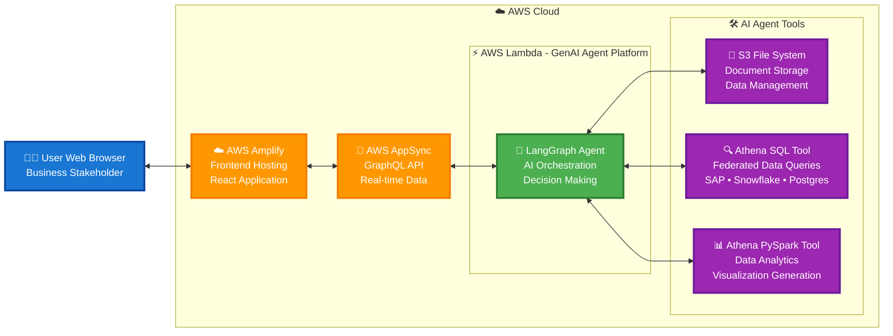

Agents4Energy (A4E) is an easily configurable and deployable, set of open-source agentic workflows to help customers in Energy industry accelerate their workloads on AWS. A4E enables industry professionals to use generative AI assistants for a range of common energy industry use cases such as reservoir characterization, well workover assessment, field data analysis, supply chain optimization, and asset integrity management.

## Architecture Overview

The following diagram illustrates the high-level architecture of the GenAI Agentic platform:

## Data Access Capabilities

**Unstructured Data Access**
- File system interface for PDFs, reports, and documents
- Upload and analyze within chat sessions
- AI-powered insights from technical documents

**Structured Data Access**
- **Data Lake**: Create databases from CSV files using Athena PySpark
- **Federated Connections**: Direct queries to SAP, Snowflake, Postgres via Athena SQL
- Real-time access without data migration

### Key Components:

- **User Interface**: React-based web application hosted on AWS Amplify
- **API Layer**: AWS AppSync GraphQL API providing real-time data synchronization
- **AI Agent**: LangGraph-powered agent running in AWS Lambda for intelligent orchestration
- **Agent Tools**: Specialized tools for data management, federated queries, and analytics
  - **S3 File System**: Document storage and data management
  - **Athena SQL Tool**: Query federated data sources (SAP, Snowflake, Postgres)
  - **Athena PySpark Tool**: Advanced data analytics and visualization generation
